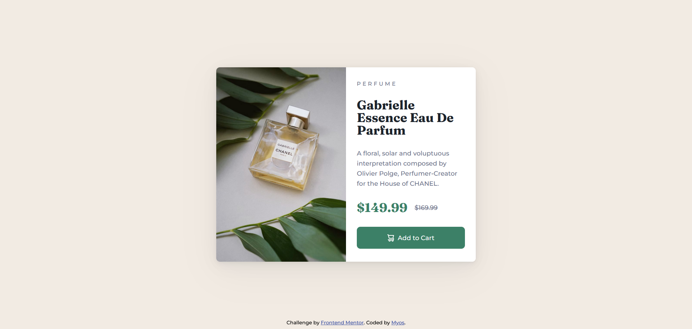

# Frontend Mentor - Product preview card component solution

This is a solution to the [Product preview card component challenge on Frontend Mentor](https://www.frontendmentor.io/challenges/product-preview-card-component-GO7UmttRfa). Frontend Mentor challenges help you improve your coding skills by building realistic projects.

## Table of contents

- [Frontend Mentor - Product preview card component solution](#frontend-mentor---product-preview-card-component-solution)
  - [Table of contents](#table-of-contents)
  - [Overview](#overview)
    - [The challenge](#the-challenge)
    - [Screenshot](#screenshot)
    - [Links](#links)
  - [My process](#my-process)
    - [Built with](#built-with)
    - [Useful resources](#useful-resources)
  - [Author](#author)

**Note: Delete this note and update the table of contents based on what sections you keep.**

## Overview

### The challenge

Users should be able to:

- View the optimal layout depending on their device's screen size
- See hover and focus states for interactive elements

### Screenshot

|                Desktop                |               Mobile                |           When hovering           |
| :-----------------------------------: | :---------------------------------: | :-------------------------------: |
|  |  |  |

### Links

- Solution URL: [https://github.com/Myoschen/fm-product-preview-card-component](https://github.com/Myoschen/fm-product-preview-card-component)
- Live Site URL: [https://myoschen.github.io/fm-product-preview-card-component](https://myoschen.github.io/fm-product-preview-card-component)

## My process

### Built with

- Semantic HTML5 markup
- CSS custom properties
- Flexbox
- CSS Grid
- Mobile-first workflow

### Useful resources

- [The picture element](https://web.dev/learn/design/picture-element/) - learn how to use the picture element
- [Smooth Shadow](https://shadows.brumm.af/) - it can make smooth shadows

## Author

- Website - [Myoschen](https://github.com/Myoschen)
- Frontend Mentor - [@Myoschen](https://www.frontendmentor.io/profile/Myoschen)
